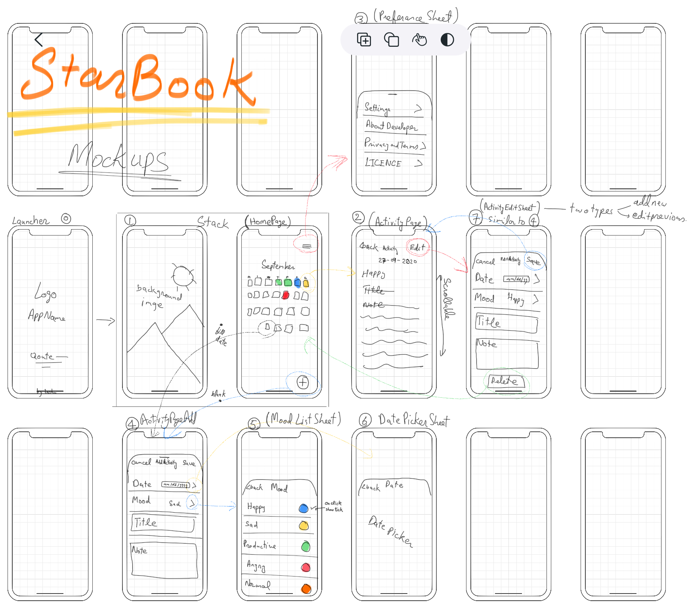

# 🤝 Contributing

Thank you for considering and taking the time to contribute! 💖 

**Working on your first Pull Request?** You can learn how from this _free_
series [How to Contribute to an Open Source Project on GitHub](https://egghead.io/series/how-to-contribute-to-an-open-source-project-on-github)

The following are guidelines for contributing to this project.

1. Fork and clone the repo.

2. Create a branch for your PR with `git checkout -b your-branch-name`

> Tip: Keep your `master` branch pointing at the original repository and make
> pull requests from branches on your fork. To do this, run:
>
> ```
> git remote add upstream https://github.com/hashirshoaeb/star_book.git
> git fetch upstream
> git branch --set-upstream-to=upstream/master master
> ```
>
> This will add the original repository as a "remote" called "upstream," Then
> fetch the git information from that remote, then set your local `master`
> branch to use the upstream master branch whenever you run `git pull`. Then you
> can make all of your pull request branches based on this `master` branch.
> Whenever you want to update your version of `master`, do a regular `git pull`.

3. Open Issue, discuss what you are planning to do.

4. Make changes and create Pull Request.

## Rules 

- [ ] Follow [Apple Human Interface Guidelines](https://developer.apple.com/design/human-interface-guidelines/ios/overview/themes/) by using Cupertino package.
- [ ] Import Cupertino package as c
- [ ] Import packages with absolute path and local files with relative path.
- [ ] Use Cupertino Dynamic colors for light and dark mode

## Mock-up

Following are the mock-up screens and the flow of the App.



## 🐛 How to Report Bugs

Please open a [new issue](https://github.com/hashirshoaeb/star_book/issues/new) including steps to reproduce the problem
you're experiencing.

Be sure to include as much information including screenshots, text output, and
both your expected and actual results.

## 🙏 Help needed

Please checkout the [issues](https://github.com/hashirshoaeb/star_book/issues) and [project board](https://github.com/hashirshoaeb/star_book/projects/1)

<br />
<p align="center">
  <h1 align="center">Thanks  ✨</h1>
</p>

## Acknowledgements

Websites that helped me in making this project through out.

- https://medium.com/flutter/learning-flutters-new-navigation-and-routing-system-7c9068155ade
- https://www.youtube.com/watch?v=nyvwx7o277U
- https://developer.apple.com/design/human-interface-guidelines/ios/visual-design/color/
- https://api.flutter.dev/flutter/widgets/TextEditingController-class.html
- https://flutter.dev/docs/cookbook/forms/text-field-changes
- https://api.flutter.dev/flutter/cupertino/CupertinoTextField-class.html
- https://www.freecodecamp.org/news/how-to-delete-a-git-branch-both-locally-and-remotely/
- https://dart.dev/guides/language/effective-dart/documentation
