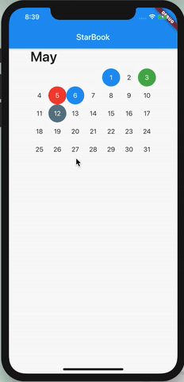

<!-- PROJECT LOGO -->
 

  <h1 align="center">StarBook ✨</h1>

  

    A digital diary that can help you in keeping track of your mood and productivity throughout the month. Mood tracker is a good way to see how you are mostly feeling. And it helped me a lot to realise how my general mood is and to improve it. Cause I was feeling down two years ago so now when I look at my mood board it looks much nicer haha. 
     
     
    <a href="https://hashirshoaeb.com">About Me</a>
    ·
    <a href="https://github.com/hashirshoaeb/star_book/issues">Report Bug</a>
    ·
    <a href="https://github.com/hashirshoaeb/star_book/issues">Request Feature</a>
  

<!-- TABLE OF CONTENTS -->

## Table Of Content

- [Demo]()
- [TODO]()
- [Contributions]()
- [Shout-out To Contributors]()
- [Starware]()

## Demo 🚀

App is under development. For now it is like this. With your help we will add more features and functionalities.

## TODO 🚀

- [x] Readme.md improvement
- [x] Adding tags
- [x] Routing
- [ ] Removing extra buttons
- [ ] Adding input text box instead of color buttons.
- [ ] Adding description in the day model

# Contributions 🤝

The App is under development. Are you interested in building and contributing to this awesome app? Your pull requests are most welcome. Any idea on how we can make this more awesome? Open a new issue! We need all the help we can get to make this project awesome!

## Shout-out To Contributors 🔥

<table>
  <tr>
    <td align="center">
      <a href="https://www.facebook.com/hashir.shoaeb">
        
         
        <b>Hashir Shoaib</b>
      </a>
       
    </td>
    <td align="center">
      <a href="https://github.com/mennorenkens">
        
         
        <b>Menno Renkens</b>
      </a>
       
    </td>
    <td align="center">
      <a href="https://github.com/zepfietje">
        
         
        <b>Zep Fietje</b>
      </a>
       
    </td>
  </tr>
</table>

## Starware

You're free to use the project, as long as you star this repository.  
Your appreciation makes us grow and glow up. ⭐
