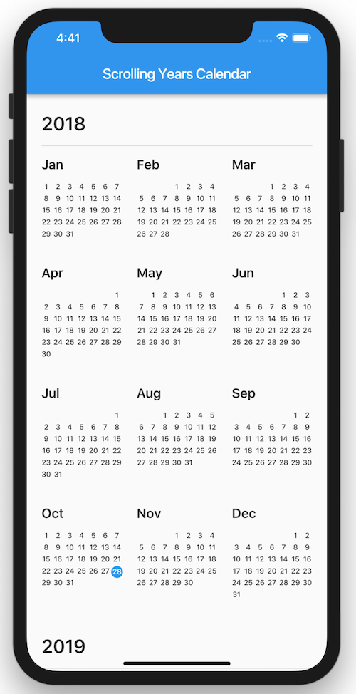

# Flutter Scrolling Calendar 🗓

A customizable calendar widget to easily scroll through the years

  

## Features

- Choose range of years and the initial year to show
- Callback on month-tap with date information
- Choose the color of the current day indicator
- Override the default month names

## Planned Features

- Customizable color indications per date
- Allow for better customization of elements
- Zoom-in to month view on tap in year-view
- Zoom-in to day view on tap in month-view
- Infinite scrolling

## Contributors

- [Menno Renkens](https://github.com/mennorenkens)
- [Zep Fietje](https://github.com/zepfietje)
- [Dutch Coding Company](https://github.com/DutchCodingCompany)

## Starware

Flutter Scrolling Calendar is Starware.  
This means you're free to use the project, as long as you star its GitHub repository.  
Your appreciation makes us grow and glow up. ⭐
