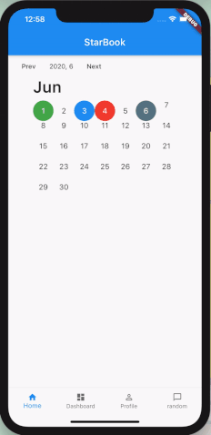

<!-- PROJECT LOGO -->
 

  <h1 align="center">StarBook ✨</h1>

  

    A digital diary that can help you in keeping track of your mood and productivity throughout the month. Mood tracker is a good way to see how you are mostly feeling. And it helped me a lot to realise how my general mood is and to improve it. Cause I was feeling down two years ago so now when I look at my mood board it looks much nicer haha. 
     
     
    <a href="https://hashirshoaeb.com">About Me</a>
    ·
    <a href="https://github.com/hashirshoaeb/star_book/issues">Report Bug</a>
    ·
    <a href="https://github.com/hashirshoaeb/star_book/issues">Request Feature</a>
  

<!-- TABLE OF CONTENTS -->

## Table Of Content

- [TODO]()
- [Contributions]()
- [Demo]()
- [Shout-out To Contributors]()
- [Starware]()

## 📝 Motivation

Psychologists define mood as a number of persistent feelings that accompany our perception and evaluation of incoming inducements, while the mood is a state of feeling which is a little less intense than emotion. The mood has a huge influence on the way we react, think, and behave, specifically in the actions we take and the feelings that get created throughout that process. To think positively and resultantly act positively how can anyone improve his mood without taking a glass of vine or exerting chocolates. Well, a very good idea is to organize the information in an orderly log producing the funniest picture of ourselves. This will make decision making and behaving efficiently. Is it really important to keep track of your daily activities? Will this really help? One common answer to both questions is “YES”. The way we feel impacts the way we think. And the way we conceive plans the actions we take, which in turn influences our experiences and ultimately, our feelings. Regular way of doing this is to make a bullet journal, but this is not something one must be doing in this modern World after all these new advancements and innovations.

## 📝 About App

“StarBook” is a digital diary, and a mood tracking app. The user will be able to rate his mood for each day and write a short story for him, like how his day was. Color is given to each mood, let’s say, green for a happy mood, red for angry and yellow for a sad mood. The statistics of users will be visualized in a methodical structure. For this the app will form a graph, calendar, each date box is colored with the color of users' aura lets say green for positive spirits. StarBook will cooperate with users to boost their positive energy and train healthy thinking, correspondingly moving towards calmer and patient personality. StarBook will use positive psychology and cognitive behavioral therapy for you to better understand yourself, overcoming stress, anxiety, and depressions. The app is all in all focused to give personalized experience to every individual user, increasing their productivity, objectivity, and emotional health.

## ☕️ TODO

- [x] Readme.md improvement
- [x] Adding tags
- [x] Routing
- [x] Adding detail in the day model
- [x] Separating editable and display screen
- [x] Removing extra buttons
- [x] Bottom navigationbar
- [x] Remove button from dates greater than current date
- [ ] Adding input text box instead of color buttons
- [ ] Adding stories
- [x] Add carousel on months
- [ ] UI Improvments
- [ ] Adding Background image

## 🤝 Contributions

The App is under development. Are you interested in building and contributing to this awesome app? Your pull requests are most welcome. Any idea on how we can make this more awesome? Open a new issue! We need all the help we can get to make this project awesome!

## 🚀 Demo

App is under development. For now it is like this. With your help we will add more features and functionalities.

## 🔥 Shout-out To Contributors

<table>
  <tr>
    <td align="center">
      <a href="https://www.facebook.com/hashir.shoaeb">
        
         
        <b>Hashir Shoaib</b>
      </a>
       
    </td>
    <td align="center">
      <a href="https://github.com/mennorenkens">
        
         
        <b>Menno Renkens</b>
      </a>
       
    </td>
    <td align="center">
      <a href="https://github.com/zepfietje">
        
         
        <b>Zep Fietje</b>
      </a>
       
    </td>
    <td align="center">
      <a href="https://github.com/alimehdi0009">
        
         
        <b>Ali Mehdi</b>
      </a>
       
    </td>
  </tr>
</table>

## ⭐ Starware

You're free to use the project, as long as you star this repository.  
Your appreciation makes us grow and glow up. ⭐
